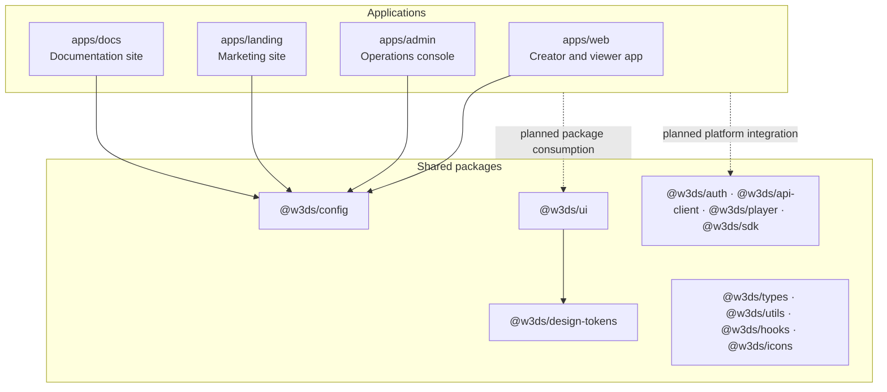
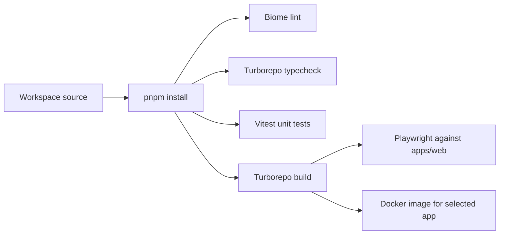

# Architecture

## Overview

W3DS Video is a pnpm/Turborepo monorepo for a decentralized video-hosting
platform. The repository currently provides the platform foundation: four
Next.js applications, shared TypeScript packages, a design-token system, and a
reusable UI library. Product workflows and service integrations have not yet
been implemented.

## Repository layout

| Area | Responsibility |
| --- | --- |
| `apps/web` | Bootstrap Next.js application for creators and viewers. |
| `apps/admin` | Bootstrap Next.js application for operational administration. |
| `apps/landing` | Bootstrap Next.js public marketing application. |
| `apps/docs` | Bootstrap Next.js documentation application. |
| `packages/design-tokens` | Framework-agnostic design tokens, generated CSS custom properties, and a Tailwind preset. |
| `packages/ui` | Shared React primitives and layout components, with Storybook stories and unit tests. |
| `packages/{auth,api-client,player,sdk}` | Public package boundaries reserved for their named concerns; their current exports are empty. |
| `packages/{config,hooks,icons,types,utils}` | Shared package boundaries; `config` exports the platform name and `utils` exports `identity`. |

## Application boundary

Each application uses the Next.js App Router under `src/app`. The current pages
are intentionally minimal bootstrap screens. Apps depend on `@w3ds/config` and
include Tailwind CSS, but they do not yet import the shared UI or token packages.

The repository does not currently contain a server-side API, database schema,
storage adapter, authentication implementation, or video-processing pipeline.
Those capabilities should not be inferred from package names or the product
description.

## Build and delivery

Turborepo coordinates workspace tasks. Build and typecheck tasks depend on their
upstream workspace dependencies; development tasks run without caching and stay
persistent.

GitHub Actions runs linting, typechecking, unit tests, builds, and Storybook
builds for pull requests and pushes to `main`. A separate job builds the
workspace and runs Chromium Playwright tests against `apps/web`.

The Dockerfile accepts an `APP` build argument (default: `web`) and builds the
selected `@w3ds/<app>` Next.js application. The included Compose configuration
exposes the production `web` app on port 3000.

## Engineering conventions

- Node.js 22.16+ and pnpm 11.20+ are required.
- All internal dependencies use the `@w3ds/*` scope and pnpm's workspace
  protocol.
- TypeScript uses ECMAScript modules.
- Biome is the repository formatter and linter.
- Unit tests use Vitest; browser tests use Playwright; component development is
  supported by Storybook in `@w3ds/ui`.
