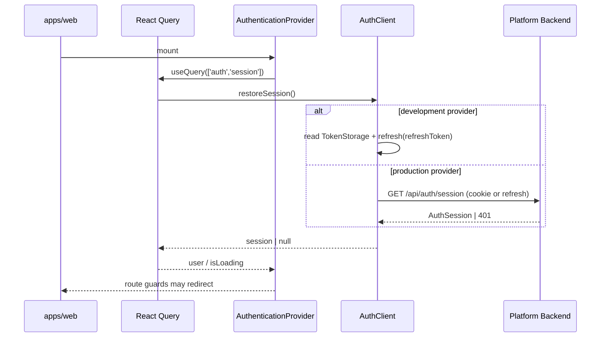
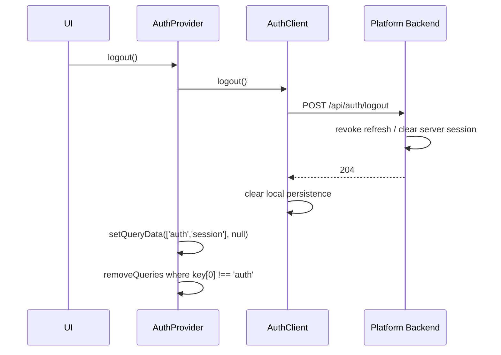
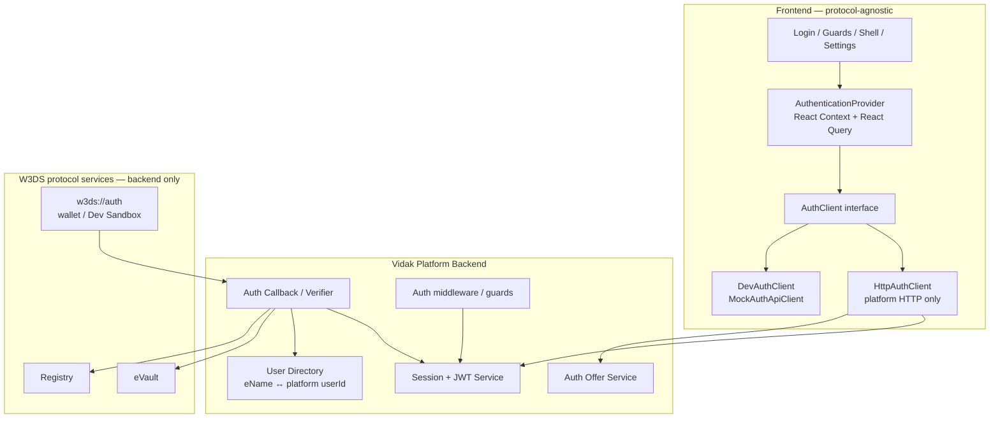

# W3DS Authentication Architecture — Vidak

**Role:** Lead Architect  
**Date:** 2026-08-04  
**Status:** Design specification (not implemented)  
**Authority:** W3DS protocol documentation under `docs/` (including `docs/reference/w3ds/`) and the current Vidak application architecture  
**Constraints:** Design only. No source changes accompany this document.

---

## 1. Purpose and principles

Vidak is a W3DS Post-Platform video product. Identity must become native `w3ds://auth`, while the product UI remains a normal video application.

This document defines how authentication works end-to-end so that:

1. The **current password/mock auth** remains a **development provider**.
2. The **production provider** uses native **W3DS authentication** (`w3ds://auth`).
3. The **UI stays protocol-agnostic** — no Registry URLs, eVault GraphQL, ontology IDs, signature formats, or `w3ds://` plumbing in feature pages.
4. The **frontend never communicates directly** with Registry, eVault, Ontology, or other protocol services.
5. **All protocol interaction happens through the platform backend.**

These principles preserve the existing seams already present in the repo:

- `@w3ds/auth` contracts and session helpers
- `AuthApi` / `MockAuthApiClient` client boundary
- `AuthenticationProvider` + React Query session cache
- route guards and product `AuthUser` / session shapes

---

## 2. Design summary

| Concern | Decision |
| --- | --- |
| Product session | Platform-issued session (JWT access + refresh, preferably HTTP-only cookies in production) |
| Protocol login | `w3ds://auth` offer → eID Wallet / Dev Sandbox signature → backend verify → platform session |
| Dev login | Existing email/password `MockAuthApiClient` (development provider) |
| UI contract | Protocol-agnostic `AuthClient` + `AuthenticationProvider` |
| Protocol boundary | Backend-only: Registry resolve, eVault `/whois`, signature verification |
| Local identity | Dual IDs: platform `userId` + global `eName` (+ eVault identifier) |
| First-time users | Find-or-create local platform user on first verified eName login |
| Cache | React Query owns session projection; logout clears non-auth queries |

```text
UI (protocol-agnostic)
  → AuthProvider
    → AuthClient (dev mock | production HTTP)
      → Vidak Platform Backend
        → W3DS Auth flow (offer + callback)
          → Registry (resolve eName → eVault)
          → eVault (/whois, key binding certificates)
        → Platform session store / JWT issuer
```

---

## 3. Complete authentication flow

### 3.1 Application startup



Startup rules:

1. React Query Provider remains outside `AuthenticationProvider` (current composition).
2. Session restore runs once per app load (`staleTime: Infinity`, `retry: false`).
3. Successful restore hydrates `['auth','session']`.
4. Failed restore clears client storage/cookies for that session and yields `null` (anonymous).
5. Guards continue to use `user` / `isLoading` only — no protocol awareness.

### 3.2 Login (production — W3DS)

Native login follows the W3DS Authentication protocol, mediated entirely by the platform backend.

```mermaid
sequenceDiagram
  participant UI as Login UI
  participant Provider as AuthProvider
  participant Client as AuthClient
  participant API as Platform Backend
  participant Wallet as eID Wallet / Dev Sandbox
  participant Registry as Registry
  participant eVault as eVault

  UI->>Provider: login({ remember })
  Provider->>Client: beginLogin(options)
  Client->>API: GET /api/auth/offer
  API->>API: generate 128-bit sessionId, store pending offer (TTL ≤ 5m)
  API-->>Client: { offerId, uri, expiresAt }
  Client-->>UI: LoginChallenge (QR / deep link / copy URI)
  Note over UI: UI shows product login challenge,<br/>not protocol internals
  Wallet->>API: POST /api/auth/callback { w3id, session, signature, appVersion? }
  API->>API: validate pending session (exists, unused, unexpired)
  API->>Registry: GET /resolve?w3id=@user...
  Registry-->>API: eVault URI + identifier
  API->>eVault: GET /whois (X-ENAME)
  eVault-->>API: key binding certificates + public keys
  API->>API: verify ECDSA P-256 / SHA-256 signature over session
  API->>API: find-or-create platform user by eName
  API->>API: mark offer consumed; issue platform tokens
  API-->>Wallet: 200 { ok: true } (or token ack)
  loop until complete / timeout
    Client->>API: GET /api/auth/offer/:offerId/status
    API-->>Client: pending | completed + session bootstrap
  end
  Client->>Client: persist session (remember preference)
  Client-->>Provider: AuthSession
  Provider->>Provider: setQueryData(['auth','session'])
  UI->>UI: navigate to returnTo
```

Login rules:

1. **Frontend never verifies signatures** and never calls Registry/eVault.
2. The wallet/sandbox POSTs to the **backend callback**, not to the SPA.
3. The SPA obtains the resulting platform session by **polling offer status** (or equivalent server-driven completion channel). This keeps cookie issuance on the platform origin and avoids putting protocol tokens in the UI.
4. `remember` remains a product preference controlling persistence duration / storage policy — not a W3DS concept.
5. Optional temporary `appVersion` checks live only on the backend (sunset per W3DS docs).

### 3.3 Login (development — mock provider)

Development keeps the current email/password path:

1. UI calls `login({ email, password, remember })`.
2. `MockAuthApiClient` validates credentials and returns `AuthSession`.
3. Provider persists via existing token storage helpers.
4. No offer URI, wallet, Registry, or eVault involvement.

Registration with email/password is **development-only**. Production identity onboarding is eVault/eID Wallet provisioning outside Vidak; Vidak only find-or-creates a local user after a verified `w3ds://auth` callback.

### 3.4 Logout



Logout rules:

1. Always clear local session even if the network logout call fails.
2. Clear all non-auth React Query data to prevent cross-user cache leakage (current behavior — preserve).
3. Production also clears HTTP-only cookies via the logout response.
4. UI redirects anonymous users through existing guards.

### 3.5 Session restore

On every cold start:

| Provider | Mechanism |
| --- | --- |
| Development | `TokenStorage.read()` → `AuthClient.refresh(refreshToken)` → rewrite storage |
| Production | `GET /api/auth/session` using cookie/refresh; optionally rotate tokens |

If restore fails with `invalid_session` / `401`:

1. Clear persistence.
2. Treat user as anonymous.
3. Do not retry in a loop.
4. Protected routes redirect to `/login?returnTo=…`.

### 3.6 Token refresh

| Concern | Development | Production |
| --- | --- | --- |
| Trigger | Explicit restore; optional future proactive refresh | Proactive refresh before `expiresAt`, plus reactive refresh on `401` |
| API | `refresh(refreshToken)` on mock client | `POST /api/auth/refresh` (cookie or body refresh token) |
| Rotation | Mock issues new access token | Rotate access token; optionally rotate refresh token |
| Failure | Clear session | Clear session + cookies; force re-auth |

Production AuthClient owns a **single-flight refresh** so concurrent React Query retries share one refresh call.

### 3.7 Expired sessions

1. Access token expiry is expected and recoverable via refresh.
2. Refresh token expiry / revocation is terminal → anonymous + login redirect.
3. Pending W3DS offers expire in **≤ 5 minutes** and are **one-time use** (W3DS replay protection).
4. Expired offer status returns `expired`; UI prompts the user to start login again.

### 3.8 Unauthorized requests

When any authenticated product API returns `401`:

```text
API 401
  → AuthClient / fetch interceptor
    → try refresh (single-flight)
      → retry original request once
      → if refresh fails: logout locally, clear RQ non-auth cache, redirect to login
```

Rules:

1. Feature hooks do not implement auth recovery themselves.
2. `AuthenticationError` / HTTP auth errors map to stable product codes (`invalid_session`, etc.).
3. Public routes tolerate anonymous callers; protected routes use `AuthenticationGuard` as today.

---

## 4. Authentication architecture

### 4.1 Component responsibilities



#### AuthProvider

Owned by `apps/web` (current `AuthenticationProvider`).

Responsibilities:

- Restore session on mount via React Query
- Expose `user`, `session`, `isLoading`, `error`
- Expose product actions: `login`, `logout`, `updateSessionUser`
- Own route helpers: `AuthenticationGuard`, `AnonymousRoute`, `getSafeReturnTo`
- Persist remember-me preference through AuthClient / storage adapters
- Clear non-auth query cache on logout

Must not:

- Build `w3ds://` URIs
- Call Registry / eVault / Ontology
- Parse signatures or JWKS
- Branch feature UX on protocol details beyond “signed in / signed out / login challenge pending”

Production `login()` may return/complete after a `LoginChallenge` flow, but the provider API remains product-shaped (see §6).

#### AuthClient

Owned by `@w3ds/auth` contracts + `@w3ds/api-client` implementations.

This is the evolutions of today’s `AuthApi`:

| Implementation | Mode | Talks to |
| --- | --- | --- |
| `MockAuthApiClient` | Development provider | In-memory users/sessions |
| `HttpAuthClient` | Production provider | Vidak platform HTTP API only |

Responsibilities:

- Begin/complete login according to active provider
- Refresh, logout, get current user, profile/session account ops that remain product-local
- Attach credentials to API requests (Authorization header and/or cookies)
- Map transport errors to `AuthenticationError`

Must not:

- Import Registry/eVault SDKs in the browser
- Embed protocol verification logic

Selection is configuration-driven (`AUTH_PROVIDER=dev|w3ds`), not UI-driven.

#### Backend (Vidak Platform API)

The sole application-facing auth authority.

Responsibilities:

- Issue `w3ds://auth` offers with cryptographically random session IDs
- Store pending offers (TTL, one-time consumption)
- Receive wallet callback POSTs
- Verify signatures using Registry + eVault public keys (via `signature-validator` or equivalent server library)
- Find-or-create platform users by eName
- Issue/revoke platform JWTs and refresh sessions
- Enforce auth middleware on protected product routes
- Resolve eName → eVault metadata for later ownership/ACL/upload work
- Never require the SPA to know protocol service URLs

#### W3DS Auth service (protocol role)

Not a Vidak microservice name — the protocol interaction surface:

- `w3ds://auth?redirect&session&platform`
- eID Wallet or Dev Sandbox signing of the session payload
- POST of `{ w3id, session, signature, appVersion? }` to the platform redirect URL

Vidak integrates this only through backend offer + callback endpoints.

#### Registry

Backend-only dependency for auth verification and identity resolution:

- `GET /resolve?w3id=…` → eVault URI / identifier
- JWKS for verifying key-binding certificate JWTs
- Entropy/provisioning remain wallet concerns, not Vidak login concerns

#### eVault

Backend-only dependency for auth verification and future data ownership:

- `GET /whois` with `X-ENAME` → public keys / key binding certificates
- Later: MetaEnvelope storage, ACLs, file references, Awareness fanout

The frontend never calls eVault GraphQL.

---

## 5. Identity model

A signed-in Vidak user is a **platform projection** of a W3DS identity plus local authorization state.

### 5.1 Canonical signed-in user

```ts
interface PlatformAuthUser {
  /** Local platform primary key (stable within Vidak). */
  id: string;

  /** Global W3ID / eName, always '@…'. */
  eName: string;

  /** eVault instance identifier from Registry resolution. */
  eVaultId: string;

  /** Resolved eVault base URI (server-enriched; optional in UI). */
  eVaultUri?: string;

  /** Product profile projection (not a MetaEnvelope). */
  profile: {
    displayName: string;
    handle?: string;
    avatarUrl?: string;
    bio?: string;
  };

  /**
   * Platform roles for coarse product authorization.
   * Orthogonal to eVault ACLs; may later be informed by them.
   */
  roles: ReadonlyArray<'creator' | 'moderator' | 'admin'>;

  /**
   * Capability flags granted by the platform session.
   * Examples: 'video:upload', 'video:publish', 'comment:create',
   * 'channel:manage', 'moderation:act'.
   */
  capabilities: ReadonlyArray<string>;

  /**
   * Concrete permissions for UI affordances and API checks.
   * Derived from roles + capabilities + resource ownership.
   */
  permissions: {
    canUpload: boolean;
    canComment: boolean;
    canManageOwnChannels: boolean;
    canModerate: boolean;
    canAccessAdmin: boolean;
  };

  /**
   * Development-provider compatibility fields.
   * Optional in production; may be absent for pure eName identities.
   */
  email?: string;
}
```

### 5.2 Session model

```ts
interface AuthTokens {
  accessToken: string;   // may be opaque to JS if cookie-based
  refreshToken?: string; // omit from JS when HTTP-only cookie is used
  expiresAt: string;     // ISO timestamp for access token
}

interface AuthSession {
  user: PlatformAuthUser;
  tokens: AuthTokens;
  provider: 'dev' | 'w3ds';
}
```

### 5.3 Mapping from current types

| Current (`AuthUser`) | Target |
| --- | --- |
| `id` | `PlatformAuthUser.id` |
| `email` | optional `email` (dev / notifications) |
| `displayName` / `avatarUrl` | `profile.*` |
| `roles` | `roles` (retained) |
| — | `eName`, `eVaultId`, `capabilities`, `permissions` |

Migration rule: extend the product identity; do not replace it with MetaEnvelope/GraphQL shapes.

### 5.4 Identity invariants

1. **eName is the global identity.** Platform `id` is the local join key for Video/Channel/Comment ownership tables.
2. **One eName → one platform user** (unique constraint).
3. **eVaultId/eVaultUri are server-resolved** and may be refreshed; they are not user-editable.
4. **Capabilities/permissions are platform-authored** for UX and API authorization; eVault ACLs remain the global data-access truth for synced entities.
5. UI displays `profile.displayName` / handle; eName may appear in account settings as an identity label, not as a protocol teaching surface.

---

## 6. Backend endpoints

All paths are platform API routes. Protocol services are not exposed to browsers.

### 6.1 Auth offer and callback (W3DS)

| Method | Path | Auth | Purpose |
| --- | --- | --- | --- |
| `GET` | `/api/auth/offer` | Public | Create pending auth offer; return `w3ds://auth` URI + `offerId` |
| `GET` | `/api/auth/offer/:offerId/status` | Public (secret offerId) | SPA polls for completion; returns session bootstrap when done |
| `POST` | `/api/auth/callback` | Public (wallet) | Wallet/Dev Sandbox callback; verify signature; complete offer |

#### `GET /api/auth/offer`

Response:

```json
{
  "offerId": "01J…",
  "uri": "w3ds://auth?redirect=https://vidak.example/api/auth/callback&session=550e8400-…&platform=vidak",
  "sessionId": "550e8400-…",
  "expiresAt": "2026-08-04T12:05:00.000Z"
}
```

Server requirements (from W3DS Authentication docs):

- 128-bit cryptographically secure session ID
- URL-encoded `redirect`
- Persist pending session for ≤ 5 minutes
- One-time use

#### `POST /api/auth/callback`

Request (wallet):

```json
{
  "w3id": "@user-a.w3id",
  "session": "550e8400-…",
  "signature": "…",
  "appVersion": "0.4.0"
}
```

Server processing:

1. Validate required fields → `400` if missing
2. Validate pending session (exists, unused, unexpired) → reject duplicates/expiry
3. Optional temporary `appVersion` gate
4. `verifySignature({ eName, signature, payload: session, registryBaseUrl })`
5. Resolve Registry + eVault `/whois` as needed by verifier
6. Find-or-create platform user
7. Issue platform session; mark offer completed
8. Respond `200` to wallet

Suggested success body (wallet ack):

```json
{ "ok": true }
```

The SPA reads completion via offer status (below), so the platform can set HTTP-only cookies on the status/session endpoints under the app origin.

#### `GET /api/auth/offer/:offerId/status`

Responses:

```json
{ "status": "pending" }
```

```json
{
  "status": "completed",
  "session": {
    "user": { "id": "…", "eName": "@user-a.w3id", "eVaultId": "…", "profile": {}, "roles": ["creator"], "capabilities": [], "permissions": {} },
    "tokens": { "accessToken": "…", "expiresAt": "…" },
    "provider": "w3ds"
  }
}
```

```json
{ "status": "expired" }
```

```json
{ "status": "failed", "error": { "code": "invalid_signature", "message": "…" } }
```

### 6.2 Platform session lifecycle

| Method | Path | Auth | Purpose |
| --- | --- | --- | --- |
| `GET` | `/api/auth/session` | Cookie / bearer | Restore current session |
| `GET` | `/api/auth/me` | Required | Current `PlatformAuthUser` |
| `POST` | `/api/auth/refresh` | Refresh credential | Rotate access token |
| `POST` | `/api/auth/logout` | Required / refresh | Revoke session |

### 6.3 Development-only endpoints (optional bridge)

If the platform backend also hosts a dev provider for integration tests:

| Method | Path | Notes |
| --- | --- | --- |
| `POST` | `/api/auth/dev/login` | Email/password; disabled in production builds |
| `POST` | `/api/auth/dev/register` | Disabled in production builds |

These must never be the production happy path.

### 6.4 Account settings endpoints (product-local)

Existing settings concerns remain platform APIs authenticated by the platform session:

- profile update
- session listing / revocation
- notification/privacy preferences

Password change / email change are development-provider concerns or optional local contact channels — not W3DS identity mutation.

### 6.5 Auth middleware contract

```text
Authorization: Bearer <accessToken>
  OR
HTTP-only session cookies set by platform
```

Middleware:

1. Extract credential
2. Verify JWT / session record
3. Load `req.user` as `PlatformAuthUser`
4. `authGuard` → `401` when missing

Public: offer, callback, webhook ingress (future), public video reads.  
Protected: upload, settings, creator mutations, etc.

---

## 7. React Query integration

### 7.1 Preserve current composition

```text
QueryClientProvider
  └── AuthenticationProvider
        └── App routes / feature pages
```

Do not invert this. Session restore remains a React Query query.

### 7.2 Query keys

| Key | Purpose |
| --- | --- |
| `['auth', 'session']` | Canonical signed-in session projection |
| `['auth', 'offer', offerId]` | Optional polling query for login challenge status |
| product keys (`video`, `settings`, …) | Unchanged; authenticated fetches use AuthClient credentials |

### 7.3 Provider behaviors

| Event | React Query action |
| --- | --- |
| Startup restore | `useQuery(['auth','session'])` |
| Login success | `setQueryData(['auth','session'], session)` |
| Logout | `setQueryData(['auth','session'], null)` + `removeQueries` for non-`auth` keys |
| Profile update | `updateSessionUser` patches session user in cache + persistence |
| Offer polling | `refetchInterval` while status is `pending`; stop on terminal state |
| `401` after failed refresh | clear session query; clear product queries |

### 7.4 AuthClient + query defaults

Production HTTP clients used by `@w3ds/hooks` should:

1. Read access credentials from AuthClient
2. On `401`, invoke AuthClient refresh once (single-flight)
3. Retry the request once
4. If still unauthorized, trigger provider logout path

Feature hooks stay product-shaped (`useVideo`, `useSettings`, …) and never import W3DS protocol clients.

### 7.5 Login challenge UX without protocol leakage

Suggested provider surface for production (UI still product language):

```ts
type LoginResult =
  | { kind: 'session'; session: AuthSession }
  | { kind: 'challenge'; challenge: LoginChallenge };

interface LoginChallenge {
  offerId: string;
  /** Opaque deeplink/QR value — treat as product 'sign-in link', not protocol API */
  signInUri: string;
  expiresAt: string;
}
```

Development provider always returns `{ kind: 'session' }` from email/password login.  
Production provider returns `{ kind: 'challenge' }`, then resolves to session when status completes.

The login page can therefore swap form fields for a “Continue with eID” challenge panel without changing guards, shell, or settings consumers.

---

## 8. Migration strategy

Goal: move from mock password auth to W3DS auth **without rewriting the UI architecture**.

### Phase 0 — Freeze seams (now)

Keep:

- `AuthenticationProvider` / guards / returnTo
- React Query session key
- `@w3ds/auth` error helpers and storage adapters
- Feature pages depending on `user`, `logout`, `session`

Treat `MockAuthApiClient` as the official **development provider**.

### Phase 1 — Widen identity contract

1. Extend `AuthUser` toward `PlatformAuthUser` with optional `eName`, `eVaultId`, `capabilities`, `permissions`, nested `profile`.
2. Have the mock provider fill synthetic values (e.g. `eName: '@demo.w3id'`, local `eVaultId`) so UI can adopt fields early.
3. Stop adding password-centric product requirements to the happy path.

### Phase 2 — Introduce AuthClient provider switch

1. Formalize `AuthClient` as the implementation interface (evolution of `AuthApi`).
2. `apps/web` selects provider via env:
   - `AUTH_PROVIDER=dev` → `MockAuthApiClient`
   - `AUTH_PROVIDER=w3ds` → `HttpAuthClient`
3. No feature-page changes beyond the login page challenge UI.

### Phase 3 — Platform backend auth spine

1. Implement offer / callback / status / session / refresh / logout.
2. Integrate Registry + eVault verification server-side.
3. Find-or-create local users by eName.
4. Issue platform JWTs.

### Phase 4 — Login UX swap

1. Production login page: “Continue with eID” + QR/deep link + Dev Sandbox instructions for local eng.
2. Development login page: keep email/password.
3. Registration route: hide or redirect in W3DS mode (wallet provisioning is external); keep in dev mode.

### Phase 5 — Harden session transport

1. Prefer HTTP-only secure cookies for production tokens.
2. Keep AuthClient abstracting whether tokens are JS-readable.
3. Add proactive refresh + 401 interceptor.
4. Retire browser-readable refresh tokens for production.

### Phase 6 — Deprecate password happy path

1. Password login remains available only when `AUTH_PROVIDER=dev`.
2. CI can run both providers’ contract tests against the same AuthClient suite.
3. Settings password/email panels become conditional on provider capabilities.

### What does not change

- Watch/channel/upload/settings page architecture
- React Query product keys
- Design system
- “UI never talks to eVault” rule from the alignment review

---

## 9. Security considerations

### 9.1 Protocol-level (W3DS)

1. **Session IDs** must be cryptographically random (128-bit), single-use, and short-lived (≤ 5 minutes).
2. **Replay prevention:** consume offer on success; reject duplicates and expired sessions.
3. **Signature verification** uses Registry resolution + eVault key binding certificates + ECDSA P-256 / SHA-256 (software base64 or hardware multibase).
4. **Generic errors** to clients; detailed verification failures only in server logs.
5. Temporary **appVersion** checks are backend-only and removable after wallet rollout.

### 9.2 Platform session security

1. Sign JWTs with a server secret / private key never shipped to the frontend (`W3DS_AUTH_JWT_SECRET`, never `NEXT_PUBLIC_*`).
2. Production session cookies use **HttpOnly**, **Secure**, **SameSite=Lax**, **Path=/** (`apps/web` `w3dsCookieOptions` / `server-config`).
3. Short access-token TTL; longer refresh TTL with rotation and reuse detection.
4. Revoke refresh tokens on logout and on remote session revoke.
5. Bind sessions to device metadata for settings “active sessions” without exposing raw refresh tokens to the UI.

### 9.3 Boundary security

1. Browser allowlist: `APP_ORIGIN` plus optional `TRUSTED_ORIGINS` (and the request’s own origin). Cookie-authenticated mutations call `assertTrustedMutationOrigin`.
2. Registry / eVault / Ontology credentials and base URLs are server env vars only.
3. CORS must not enable credentialed cross-origin browser access; wallet posts to the backend callback without SPA CORS.
4. Offer status endpoints must use unguessable `offerId`s and expire with the offer.
5. Never return eVault admin tokens, platform private keys, JWT secrets, or JWKS private material to the client.
6. Production requires explicit `AUTH_PROVIDER`; incomplete W3DS config fails at startup / with `configuration_error` rather than falling back to `dev`.

### 9.4 Application security

1. Preserve logout cache clearing to avoid cross-account data bleed. Logout/refresh still require a trusted origin for cookie callers so cross-site requests cannot clear or rotate sessions.
2. `returnTo` remains same-origin path only (`getSafeReturnTo`).
3. Capability checks on mutations (upload/publish/moderate) are enforced server-side; UI permissions are advisory.
4. Dev auth is available only when `AUTH_PROVIDER=dev` is explicit (required in production) or when non-production defaults apply.
5. Rate-limit offer creation and callback verification (deferred; not part of the current security baseline).

---

## 10. Future compatibility

Authentication is the root capability for every later W3DS-aligned feature. This design enables each without redesigning identity.

### Ownership

- Platform user stores `eName` + `eVaultId`.
- Uploads and channel writes use `ownerEnamePath` from the authenticated eName.
- Local rows keep `userId`; adapter sync uses eName as global owner.

### ACLs

- Product `visibility` maps to MetaEnvelope `acl` in the backend/adapter layer.
- Session `permissions` can reflect whether the caller is owner/collaborator.
- UI continues to show Public / Unlisted / Private — not raw ACL arrays.

### Uploads

- Auth session proves who may create upload intents.
- Backend attaches owner eName when creating File / Video records and when calling `uploadFile` / storage APIs.
- Large-object direct upload stays server-orchestrated; browser never needs eVault GraphQL.

### Channels

- Channel ownership binds to platform user id and owner eName.
- Authorization for manage/upload checks session user against channel owner (and later group eVault roles).
- Removes hardcoded `channel-studio` class bugs by using authenticated identity.

### Comments

- Comment create/edit/delete authorized by session capabilities + ownership.
- If comments sync globally later, author eName is already available from auth.

### Collections (playlists)

- Collection mutations require authenticated owner/capability.
- Same dual-ID pattern as videos/channels when ontology mapping arrives.

### Awareness

- Webhook ingress remains unauthenticated in the W3DS sense (platform verifies Awareness signatures/secrets server-side).
- Authenticated product sessions are separate from webhook trust.
- React Query invalidation can target entities by local id / global id once auth establishes the user projection boundary.

### Ontology

- Auth does not embed ontology IDs in the UI.
- Backend can attach `schemaId`s when writing MetaEnvelopes because it already knows the actor eName and platform user.
- `@w3ds/sdk` may later hold platform-facing helpers (offer client types, eName parsing) — still not raw protocol sprawl in feature packages.

```text
Authenticated eName
  → ownership on local rows
  → adapter outbound sync (ownerEnamePath)
  → ACL mapping from visibility
  → Awareness fanout to other platforms
  → inbound webhooks → local projection → React Query
```

---

## 11. Provider capability matrix

| Capability | Dev provider | W3DS provider |
| --- | --- | --- |
| Email/password login | Yes | No |
| Register with password | Yes | No |
| `w3ds://auth` offer/challenge | No | Yes |
| eName on user | Synthetic | Real |
| eVault id | Synthetic/placeholder | Registry-resolved |
| Token verify via Registry/eVault | No | Yes (backend) |
| Platform JWT/session | Mock tokens | Real |
| Settings: change password | Yes | Hidden / N/A |
| Settings: sessions revoke | Yes (mock) | Yes (server) |
| UI guards / RQ session key | Yes | Yes |

---

## 12. Environment configuration (backend)

Required for production W3DS auth:

```bash
AUTH_PROVIDER=w3ds
PUBLIC_VIDAK_BASE_URL=https://vidak.example
PUBLIC_REGISTRY_URL=https://registry.example.com
JWT_SECRET=…                 # or asymmetric key material
AUTH_OFFER_TTL_SECONDS=300
AUTH_ACCESS_TTL_SECONDS=900
AUTH_REFRESH_TTL_SECONDS=604800
W3DS_PLATFORM_NAME=vidak
# optional during wallet rollout
W3DS_MIN_APP_VERSION=0.4.0
```

Development:

```bash
AUTH_PROVIDER=dev
```

Frontend only needs the platform API base URL and provider mode — never Registry/eVault URLs.

---

## 13. Acceptance criteria

This architecture is correctly applied when:

1. Production login completes through `w3ds://auth` with backend signature verification.
2. Development login still works through the mock provider without protocol services.
3. Feature pages and guards depend only on `AuthSession` / `PlatformAuthUser`.
4. No browser network traffic to Registry, eVault, or Ontology during auth.
5. Logout and `401` handling clear session state and product caches safely.
6. Authenticated users carry eName + eVault identifier + platform id for later ownership/ACL/upload work.
7. Switching `AUTH_PROVIDER` does not require rewriting Watch/Channel/Upload/Settings UI.

---

## 14. References

- W3DS Authentication (`w3ds://auth`) — protocol steps, offer/callback, security
- Getting Started with Platform Development — platform JWT, middleware, offer/login pattern
- Using the Dev Sandbox — local auth testing without eID Wallet
- Signing / Signature Formats — verification via Registry + eVault `/whois`
- Registry — eName resolution and JWKS
- eVault — key binding certificates and ownership model
- W3DS Basics — Post-Platform data flow
- `docs/architecture/w3ds-alignment-review.md` — current alignment gaps and milestone framing
- Current implementation seams: `@w3ds/auth`, `MockAuthApiClient`, `AuthenticationProvider`
