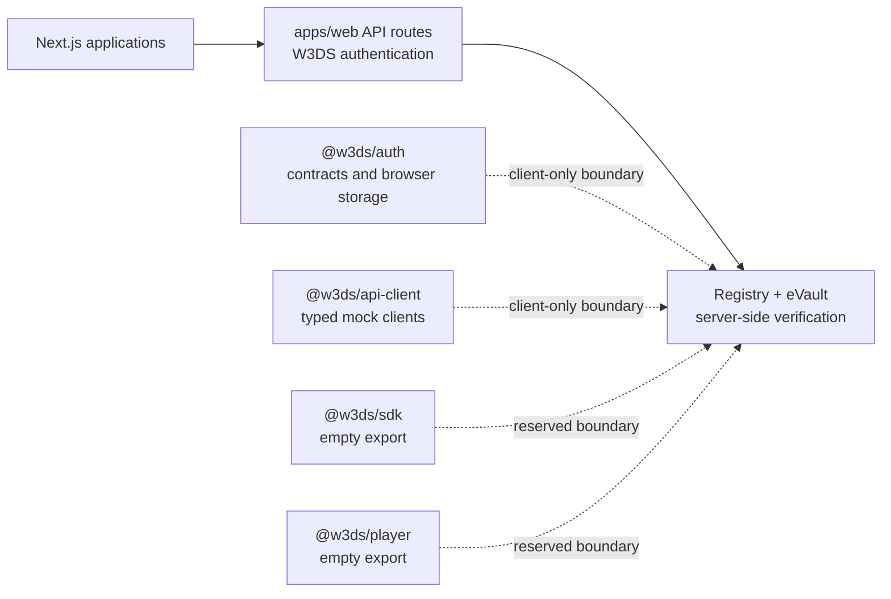

# Backend

## Current state

The first platform backend capability is native W3DS authentication, hosted as
Next.js route handlers in `apps/web`. There is still no general-purpose API,
database model, queue worker, storage integration, or video-processing
pipeline.

The platform description and package names establish intended domains, but they
do not constitute implemented runtime capabilities.

## W3DS authentication backend

`apps/web` exposes these Node.js route handlers:

| Method | Path | Purpose |
| --- | --- | --- |
| `GET` | `/api/auth/offer` | Create a one-time, five-minute `w3ds://auth` login offer. |
| `POST` | `/api/auth/callback` | Receive the wallet callback and verify its signature server-side. |
| `GET` | `/api/auth/offer/:offerId/status` | Let the same-origin SPA poll for login completion. |
| `GET` | `/api/auth/session` | Restore an authenticated platform session. |
| `GET` | `/api/auth/me` | Read the current platform user. |
| `POST` | `/api/auth/refresh` | Rotate an HTTP-only refresh session. |
| `POST` | `/api/auth/logout` | Revoke a platform session and clear cookies. |

The backend resolves the W3ID in Registry, loads key-binding certificates from
the resolved eVault's `/whois` endpoint, verifies the Registry-signed ES256
certificates, and verifies the eID wallet's ECDSA P-256 signature over the
one-time session ID. The browser never contacts those protocol services or
receives their certificates or public-key material.

The platform issues signed access and refresh JWTs. Both are set as `HttpOnly`,
`SameSite=Lax` cookies; the access credential has a 15-minute lifetime and the
refresh credential rotates with a seven-day lifetime. `Authorization: Bearer`
access tokens are accepted for server-to-server/API clients.

Configure the flow with the root `.env.example` values:

- `W3DS_REGISTRY_BASE_URL`
- `W3DS_AUTH_JWT_SECRET` (32+ secret characters)
- `W3DS_AUTH_PLATFORM_NAME` (optional; defaults to `vidak`)
- `W3DS_AUTH_MIN_WALLET_VERSION` (optional temporary compatibility gate)

The current session, offer, and user stores are process-local because Vidak
does not yet have a database. This is suitable for local development and a
single long-lived Node instance only. Before deployment to a multi-instance or
serverless environment, replace those stores with durable shared persistence,
add offer/session cleanup, rate limiting, and structured security audit logs.

## Other server-side behavior

The applications can be built and served by Next.js. This is the only current
server runtime:

- Each app exposes the standard `next dev`, `next build`, and `next start`
  scripts.
- The Dockerfile builds one selected application and runs its standalone
  Next.js server.
- The included Compose configuration builds and exposes the `web` application
  on port 3000 with `NODE_ENV=production`.

Other than W3DS authentication, no custom request handling, API contract, or
external service connection is defined in the applications.

## Package boundaries

The monorepo already reserves packages that can host future backend-facing
concerns:

| Package | Current implementation |
| --- | --- |
| `@w3ds/auth` | Authentication contracts, role helpers, and browser token-storage adapters. |
| `@w3ds/api-client` | Typed in-memory mock clients, including `MockAuthApiClient`. |
| `@w3ds/sdk` | Empty module. |
| `@w3ds/player` | Empty module. |
| `@w3ds/types` | Empty module. |
| `@w3ds/utils` | Exports a generic `identity` helper only. |
| `@w3ds/config` | Exports the `platformName` constant only. |

These boundaries should be treated as ownership locations, not public APIs or
service contracts.

## Delivery and verification

Backend-oriented infrastructure is limited to the repository tooling:

- GitHub Actions validates pull requests and pushes to `main` with lint,
  typecheck, unit tests, build, Storybook build, and browser tests.
- Docker supports production builds for a selected app through the `APP` build
  argument.
- pnpm workspaces and Turborepo manage dependency ordering and task execution.

When a backend is introduced, document its API versioning, authentication and
authorization model, persistence strategy, storage lifecycle, observability,
and operational runbooks alongside the implementation.
