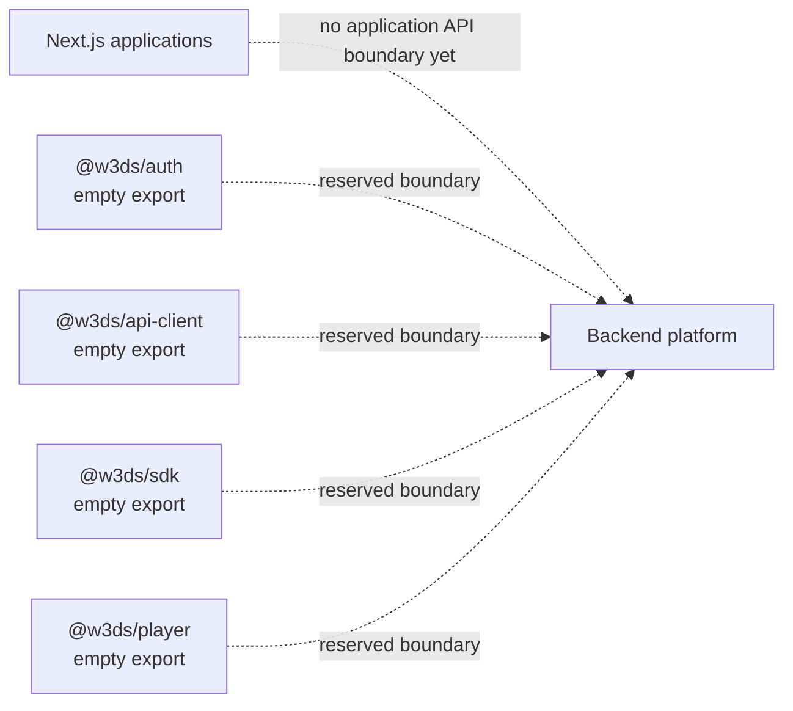

# Backend

## Current state

This repository does not yet implement a backend service. There are no API
route handlers, server actions, database models, persistence adapters, queue
workers, storage integrations, authentication flows, or video-processing
pipelines in the current source tree.

The platform description and package names establish intended domains, but they
do not constitute implemented runtime capabilities.

## Existing server-side behavior

The applications can be built and served by Next.js. This is the only current
server runtime:

- Each app exposes the standard `next dev`, `next build`, and `next start`
  scripts.
- The Dockerfile builds one selected application and runs its standalone
  Next.js server.
- The included Compose configuration builds and exposes the `web` application
  on port 3000 with `NODE_ENV=production`.

No custom request handling, API contract, or external service connection is
defined in the applications.

## Package boundaries

The monorepo already reserves packages that can host future backend-facing
concerns:

| Package | Current implementation |
| --- | --- |
| `@w3ds/auth` | Empty module. |
| `@w3ds/api-client` | Empty module. |
| `@w3ds/sdk` | Empty module. |
| `@w3ds/player` | Empty module. |
| `@w3ds/types` | Empty module. |
| `@w3ds/utils` | Exports a generic `identity` helper only. |
| `@w3ds/config` | Exports the `platformName` constant only. |

These boundaries should be treated as ownership locations, not public APIs or
service contracts.

## Delivery and verification

Backend-oriented infrastructure is limited to the repository tooling:

- GitHub Actions validates pull requests and pushes to `main` with lint,
  typecheck, unit tests, build, Storybook build, and browser tests.
- Docker supports production builds for a selected app through the `APP` build
  argument.
- pnpm workspaces and Turborepo manage dependency ordering and task execution.

When a backend is introduced, document its API versioning, authentication and
authorization model, persistence strategy, storage lifecycle, observability,
and operational runbooks alongside the implementation.
