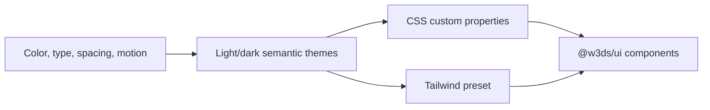

# Architecture decisions

## Status

This log records decisions evidenced by the current repository configuration
and implementation. It does not infer intent beyond what is present in source
code, package metadata, and committed history.

## ADR-001: Use a pnpm and Turborepo monorepo

**Status:** Accepted; **Evidence:** `pnpm-workspace.yaml`, `turbo.json`, root `package.json`

The repository groups deployable applications and shared libraries in one
workspace. pnpm workspaces resolve internal packages through the workspace
protocol; Turborepo orders dependent build and typecheck tasks and runs
development tasks in parallel.

**Consequences**

- Shared code can be versioned and verified with its consumers in one change.
- Workspace task definitions must remain accurate so builds execute in the
  correct dependency order.

## ADR-002: Use Next.js applications with the App Router

**Status:** Accepted; **Evidence:** `apps/*/src/app`, `apps/*/package.json`

Web, admin, landing, and documentation interfaces are separate Next.js
applications using the App Router structure.

**Consequences**

- Each experience can be built and deployed as an independent app.
- Shared frontend behavior belongs in workspace packages instead of application
  copies when it is broadly reusable.

## ADR-003: Separate design tokens from UI components

**Status:** Accepted; **Evidence:** `packages/design-tokens`, `packages/ui`

Visual decisions live in a framework-agnostic token package. The React UI
package consumes semantic token names in Tailwind classes and exports reusable
primitives and layouts.

**Consequences**

- Theme values can change independently of component APIs.
- Applications need to import the token CSS and configure the preset before
  relying on the shared UI styles.

## ADR-004: Standardize repository quality tooling

**Status:** Accepted; **Evidence:** `biome.json`, `vitest.config.ts`, `playwright.config.ts`,
`.github/workflows/ci.yml`

Biome is the single formatter and linter. Vitest provides unit-test execution,
Playwright provides Chromium browser tests, and GitHub Actions validates the
defined quality and build tasks.

**Consequences**

- Local and CI checks use one documented toolchain.
- New code should be covered by the applicable unit, browser, and component
  verification paths.

## ADR-005: Package future platform domains before implementation

**Status:** Accepted as repository structure; **Evidence:** `packages/auth`, `packages/api-client`, `packages/player`,
`packages/sdk`, `packages/types`, `packages/hooks`, `packages/icons`

The repository includes named packages for several future domains, although
most currently have empty exports.

**Consequences**

- Package names establish likely ownership boundaries.
- No package should be presented as a functional API until it exposes an
  implemented, tested contract.

## ADR-006: Support containerized builds per application

**Status:** Accepted; **Evidence:** `Dockerfile`, `docker-compose.yml`

The Docker build accepts an `APP` argument, builds the selected application,
and runs its standalone Next.js output. Compose currently targets the web app.

**Consequences**

- A common container path exists for the apps that produce standalone output.
- Runtime configuration, service dependencies, and production orchestration
  remain to be defined when platform services are introduced.
