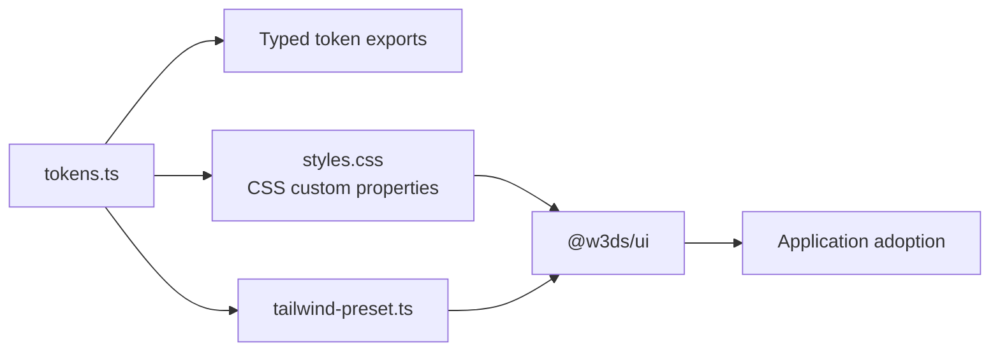

# Design system

## Purpose

The design system is implemented in two layers:

1. `@w3ds/design-tokens` defines the visual language in TypeScript and CSS.
2. `@w3ds/ui` composes those tokens into reusable React primitives and layouts.

The application bootstrap screens currently use local CSS rather than these
packages. The design system is therefore available for adoption, not yet the
active visual foundation of every app.



## Tokens

`@w3ds/design-tokens` provides:

- primitive colors: slate, blue, emerald, amber, red, white, and black;
- semantic light and dark themes for backgrounds, surfaces, borders, text,
  primary actions, and status states;
- Inter-based sans-serif and JetBrains Mono font stacks;
- font sizes, weights, and letter spacing;
- spacing, radii, elevation, motion, breakpoints, and z-index scales.

`styles.css` exposes the token values as `--w3ds-*` custom properties. The
default `:root` values are light; `[data-theme="dark"]` and `.dark` apply the
dark semantic-color mappings.

### Semantic color usage

Use semantic tokens such as `background`, `foreground`, `surface`, `border`,
`primary`, `success`, `warning`, and `danger` instead of hard-coded color
values. This keeps components compatible with both provided themes.

The Tailwind preset maps the semantic tokens to utilities including
`bg-primary`, `text-muted-foreground`, and `border-border`. It is
framework-agnostic and does not introduce a Tailwind runtime dependency.

## UI library

`@w3ds/ui` exports typed React components in two groups:

| Group | Components |
| --- | --- |
| Primitives | Text, Heading, Label, Button, IconButton, LoadingButton, Input, SearchInput, Textarea, Checkbox, Radio, Switch, Card, Avatar, Badge, Tag, Divider, Spinner, Skeleton |
| Layout and states | Header, Sidebar, MobileNavigationDrawer, AppShell, Breadcrumbs, Container, Page, Section, Stack, Grid, SplitPane, EmptyState, ErrorState, LoadingState |

Components are styled with Tailwind utility classes that reference semantic
tokens. They expose regular HTML attributes and typed props, use `forwardRef`
where appropriate, and include responsive layouts for the supplied breakpoints.

## Interaction and accessibility

The current components include several built-in accessibility practices:

- keyboard-visible focus rings on interactive elements;
- native labels and generated IDs for checkbox and radio controls;
- `aria-invalid` for invalid text fields;
- `aria-busy` and disabled behavior for loading buttons;
- status semantics for loading indicators;
- labels for navigation landmarks and breadcrumbs;
- a modal mobile-navigation drawer with Escape handling and focus containment.

Consumers remain responsible for meaningful labels, alternative text, valid
heading structure, and accessible application-specific flows.

## Working with the system

Import token CSS once at the application root before using components whose
classes reference the semantic token names. Import the Tailwind preset into a
Tailwind configuration when the consuming app needs the corresponding utility
classes.

Develop and verify UI components with:

```bash
pnpm --filter @w3ds/ui storybook
pnpm --filter @w3ds/ui test
pnpm --filter @w3ds/ui typecheck
```

Stories and unit tests currently cover the primitives and layout components.
