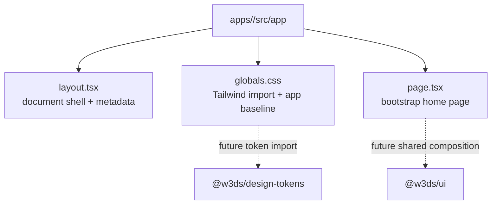

# Frontend

## Application structure

The frontend consists of four independent Next.js applications:

| Application | Package | Current purpose |
| --- | --- | --- |
| Web | `@w3ds/web` | Creator and viewer product entry point. |
| Admin | `@w3ds/admin` | Operational administration entry point. |
| Landing | `@w3ds/landing` | Public marketing entry point. |
| Docs | `@w3ds/docs` | Product and developer documentation entry point. |

Each app uses the App Router and currently contains a root layout, a global
stylesheet, and one bootstrap home page under `src/app`. All layouts supply
application metadata and declare English as the document language.



## Framework and styling

- Next.js and React provide rendering and routing.
- TypeScript is used throughout.
- Tailwind CSS is imported through each app's `globals.css`, with
  `@tailwindcss/postcss` configured as the PostCSS plugin.
- Current app baseline styles set a dark color scheme, dark background, light
  text, Arial fallback typography, and a constrained main-content width.

The current global styles duplicate this baseline across the four apps. The
shared token and UI packages provide a path to standardize future app styling,
but are not yet wired into the applications.

## Local development

Install dependencies from the repository root, then start all workspace
development tasks:

```bash
pnpm install
pnpm dev
```

Run a single application with pnpm filtering:

```bash
pnpm --filter @w3ds/web dev
```

The Playwright configuration starts `@w3ds/web` at `http://127.0.0.1:3000`
for browser tests. The other apps are separate Next.js projects and use the
standard `next dev`, `next build`, and `next start` commands supplied by their
package scripts.

## Shared frontend packages

| Package | Current frontend role |
| --- | --- |
| `@w3ds/design-tokens` | Typed design tokens, CSS variables, and a Tailwind preset. |
| `@w3ds/ui` | React primitives, layout components, component stories, and tests. |
| `@w3ds/icons` | Reserved package boundary; no icons are exported yet. |
| `@w3ds/hooks` | Reserved package boundary; no hooks are exported yet. |
| `@w3ds/player` | Reserved package boundary; no player implementation is exported yet. |

## Quality checks

Use the following repository-level commands before submitting frontend changes:

```bash
pnpm lint
pnpm typecheck
pnpm test:unit
pnpm build
pnpm test:e2e
```

`pnpm lint` runs Biome across the repository. Unit tests run in Vitest with
Node as the default environment, while end-to-end tests run in Chromium through
Playwright. Storybook can be built with `pnpm storybook:build`.

## Public video navigation and share links

Browser-facing watch links for published videos use only the opaque
`publicVideoId` (`pub_…`):

| Surface | Path |
| --- | --- |
| Home discovery cards | `/watch/{publicVideoId}` |
| Creator share link (public / unlisted) | `{origin}/watch/{publicVideoId}` |
| Public media stream (player `src`) | `/api/videos/public/{publicVideoId}/media/{assetId}/content` |

Rules:

- Share links never include storage keys, filesystem paths, or internal draft
  video ids.
- Home discovery lists only `published` + `public` videos from
  `GET /api/videos/public`.
- Unlisted published videos are reachable by share link but do not appear in
  discovery.
- Drafts and private videos are not rendered through public watch UI; the watch
  page shows an unavailable state instead.
- Development auth (`AUTH_PROVIDER=dev`) keeps the in-memory mock client, which
  mirrors the same public id and visibility rules for local browsing.
