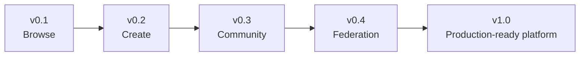
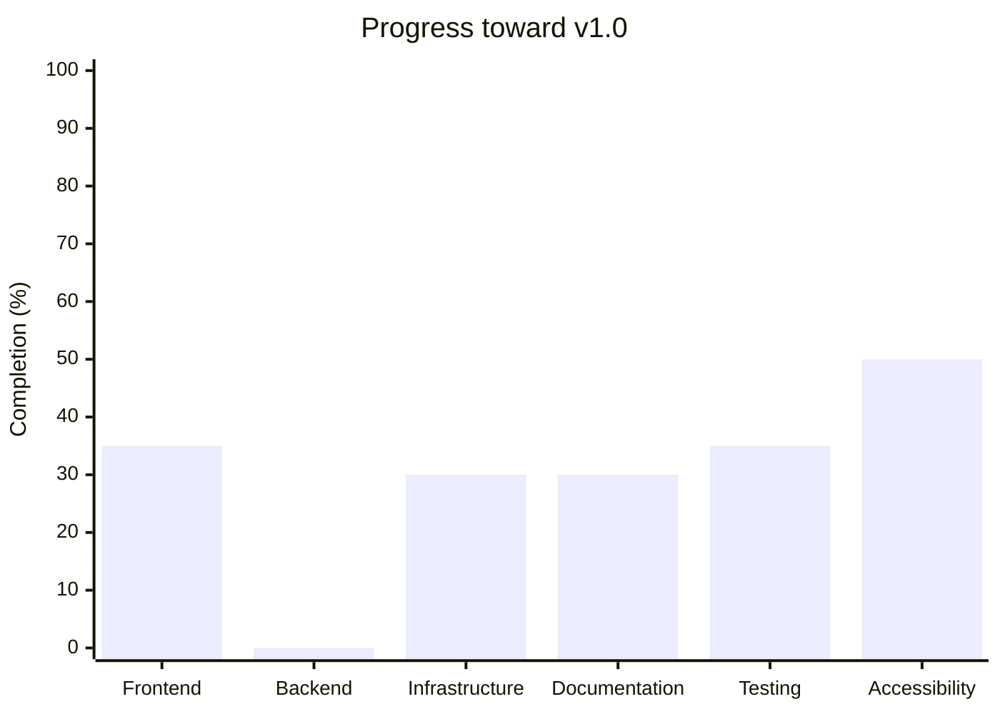
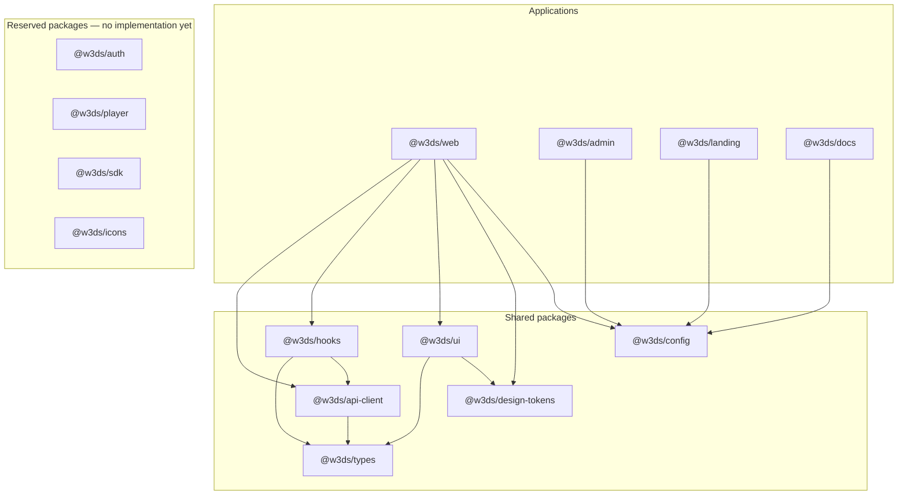

# Product Roadmap

This is the product-level source of truth for W3DS Video. It records the
implemented product surface, the intended release sequence, and the work that
is still required. Statuses are evidence-based and must be updated when the
repository's capabilities change.

## Vision

W3DS Video will be a privacy-respecting, decentralized video platform where
creators can publish and own their work, communities can discover and discuss
it, and people can choose interoperable services without losing access to their
identity or audience. The platform will combine a fast, accessible,
mobile-first viewing experience with open protocols and federation, while
keeping users in control of their data and media.

---

## Product Principles

- Privacy first
- Open standards
- Federation
- Accessibility
- Performance
- Offline-first where possible
- Mobile-first
- Creator-first

---

## Release Plan

### v0.1 — Browse

**Status:** In Progress

Implemented:

- Home Feed
- Responsive UI

Planned for this release:

- Watch Page
- Channel Page
- Search

### v0.2 — Create

- Authentication
- Upload
- Video processing
- Creator Studio
- Video management

### v0.3 — Community

- Comments
- Likes
- Playlists
- Subscriptions
- Notifications

### v0.4 — Federation

- ActivityPub
- Remote channels
- Remote subscriptions
- Moderation federation
- Identity federation

### v1.0

Production-ready decentralized platform.

---

## Milestones

### Completed

- [x] Repository
- [x] Monorepo
- [x] Design Tokens
- [x] UI Primitives
- [x] Application Shell
- [x] Documentation
- [x] Domain Model
- [x] Home Feed

### In Progress

- [ ] v0.1 Browse release completion
- [ ] Product roadmap maintenance

### Future

- [ ] v0.2 Create
- [ ] v0.3 Community
- [ ] v0.4 Federation
- [ ] v1.0 Production readiness

## Feature Matrix

| Feature | Status | Priority | Release |
| --- | --- | --- | --- |
| Home Feed | Complete | High | v0.1 |
| Responsive UI | Complete | High | v0.1 |
| Watch Page | Planned | High | v0.1 |
| Channel Page | Planned | High | v0.1 |
| Search | Planned | High | v0.1 |
| Authentication | Planned | High | v0.2 |
| Upload and processing | Planned | High | v0.2 |
| Creator Studio and video management | Planned | High | v0.2 |
| Comments, likes, and playlists | Planned | Medium | v0.3 |
| Subscriptions and notifications | Planned | Medium | v0.3 |
| ActivityPub and federated identity | Planned | High | v0.4 |

## Architecture Progress

The percentages are directional progress estimates against the v1.0 target,
not delivery forecasts. They reflect the repository as of the Home Feed:
shared frontend foundations and a typed mock API exist; no production backend
or federation service is implemented.

- **Frontend — 35%:** shared UI, theme tokens, application shell, and Home Feed
  are implemented.
- **Backend — 0%:** the current client is a typed mock; no server-side platform
  service is implemented.
- **Infrastructure — 30%:** workspace automation, CI, Docker build support, and
  a standalone web build are present.
- **Documentation — 30%:** product and architecture documentation exists, but
  several documents need synchronization with the implemented Home Feed.
- **Testing — 35%:** unit tests, a minimal browser test, Storybook, and CI exist;
  product interaction coverage remains limited.
- **Accessibility — 50%:** semantic primitives, focus handling, labelled
  landmarks, and responsive navigation are in place; browser-level verification
  is still needed.

## Package Dependency Diagram

## Technical Debt

The following follow-up work is tracked from `REVIEW.md`:

- Synchronize architecture, frontend, backend, design system, decisions, and
  engineering roadmap documentation with the domain model, mock API, React
  Query hooks, token adoption, and Home Feed.
- Add Playwright coverage for public-video rendering, theme switching, mobile
  drawer Escape behavior, keyboard focus, and infinite scrolling.
- Add Storybook interaction tests for the mobile drawer focus trap, tags,
  switches, and VideoCard links.
- Replace the Home Feed's per-card channel lookups with channel summaries or a
  batched endpoint when the real API contract is defined.
- Add a generation command or consistency test to keep token `styles.css` in
  sync with its TypeScript source.

## Future Ideas

- Live streaming
- Podcasts
- WebRTC
- Offline downloads
- AI moderation
- AI subtitles
- AI search
- AI recommendations
- Mobile apps
- Desktop app
- TV apps

## Next 10 Milestones

These are the next implementation milestones after the completed Home Feed.
They are ordered by existing routes, data types, hooks, and review findings;
they do not represent work that is already implemented.

1. Implement the `/watch/[id]` route using the existing video query contract.
2. Build the shared `@w3ds/player` playback component required by the watch
   experience.
3. Implement the `/channel/[id]` route using the existing channel and
   channel-filtered video queries.
4. Surface existing comment data and pagination on the watch page.
5. Implement a search results route using the current video search filter and
   shared SearchInput.
6. Implement a playlist detail route from the existing playlist query contract.
7. Implement a user profile route from the existing user-profile query contract.
8. Add Library and Subscriptions route shells for the navigation destinations
   already present in the application.
9. Harden the Home Feed with browser-level coverage, Storybook interaction
   tests, and an API design that removes per-card channel lookups.
10. Synchronize implementation documentation and add a guardrail against token
    stylesheet drift.
