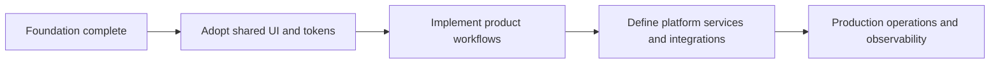

# Roadmap

## Scope note

This is an evidence-based implementation roadmap, not a product commitment.
It records work that is already complete and the next logical areas implied by
the current repository structure. Dates, delivery order, and external
integrations are intentionally not specified because they are not present in
the repository.

## Completed foundation

- [x] pnpm workspace and Turborepo task orchestration.
- [x] Four Next.js application shells: web, admin, landing, and docs.
- [x] Shared TypeScript package boundaries under the `@w3ds/*` scope.
- [x] Design tokens for light and dark semantic themes, typography, spacing,
  motion, elevation, breakpoints, and z-index.
- [x] Shared React UI primitives and responsive layout components.
- [x] UI unit tests and Storybook stories.
- [x] Repository-wide linting, typechecking, unit testing, browser testing,
  CI workflow, and Docker build path.

## Near-term repository work

### Frontend adoption

- Connect the applications to `@w3ds/design-tokens` and `@w3ds/ui`.
- Replace bootstrap pages with the information architecture and workflows each
  application requires.
- Add application-level browser coverage as pages and interactions are added.

### Shared package implementation

- Define versioned public APIs for the currently empty `auth`, `api-client`,
  `player`, `sdk`, `types`, `hooks`, and `icons` packages only when their
  consuming use cases are defined.
- Keep reusable behavior in shared packages rather than duplicating it across
  applications.

### Platform definition

- Establish the backend architecture before implementing consumers of it.
- Document contracts, persistence, identity, authorization, media handling,
  deployment, and observability when those capabilities are selected and
  implemented.

## Guardrails

- Do not represent reserved package names as shipped features.
- Keep the shared design system token-based and theme-aware.
- Preserve the current quality gates: Biome, TypeScript, Vitest, Playwright,
  Next.js builds, and Storybook builds.
- Update this roadmap when implemented code changes the available platform
  capabilities.
